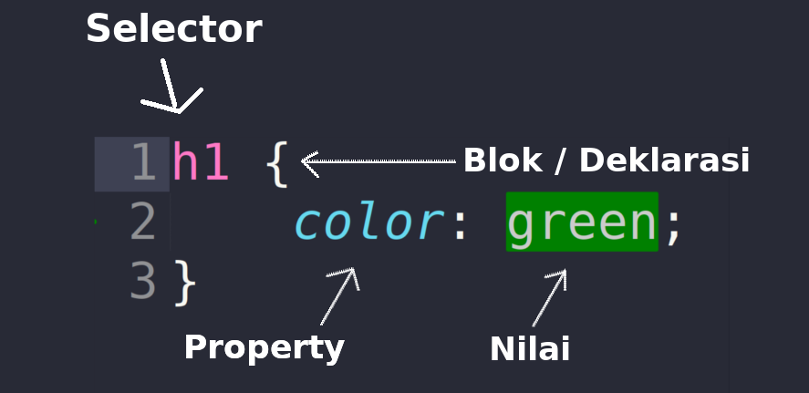

# Modul 3: CSS (CASCADING STYLE SHEETS)
## Tujuan Praktikum
Setelah mengikuti praktikum ini praktikan diharapkan dapat:
1. Praktikan dapat memahami pengertian, sejarah, dan konsep dasar CSS
2. Praktikan dapat mengetahui framework CSS
3. Praktikan dapat mengetahui dan memahami struktur CSS
4. Praktikan dapat mensimulasikan CSS untuk membangun atau mempercantik
website

## Alat & Bahan
Alat dan bahan yang digunakan pada praktikum kali ini:
1. Laptop
2. Text Editor

## Dasar Teori
### Pengenalan CSS
CSS atau Cascading Style Sheets adalah bahasa yang digunakan untuk mendesain dan mengatur tampilan halaman web. Dengan CSS, pengembang dapat memisahkan konten (yang biasanya ditulis dalam HTML) dari aspek visualnya, sehingga memudahkan pengelolaan dan perubahan desain tanpa harus mengubah struktur konten. CSS mengumpulkan kode progran untuk mempercantik atau mendesain tampilan HTML. Kita bisa mengubah desain dari teks, warna, gambar dan latar belakang dari semua kode tag HTML. CSS bekerja didalam tag-tag `<html>`. CSS biasanya digunakan untuk memformat tampilan web yang dibuat dengan bahasa HTML dan XHTML.

CSS bermula dari SGML (Standard Generalized Markup Language) pada tahun 1970-an dan mengalami perkembangan pesat. Ide dasar CSS dikemukakan oleh Hakon Wium Lie dalam proposalnya tentang Cascading HTML Style Sheets (CHSS) pada Oktober 1994 di konferensi W3C. Bersama Bert Bos, mereka mengembangkan standar CSS, yang resmi dipublikasika pada tahun 1996 dengan dukungan Thomas Reardon dari Microsoft.

Nama "Cascading Style Sheets" mencerminkan cara deklarasi gaya dapat disusun secara berurutan, membentuk hubungan ayah-anak (parent-child). CSS direkomendasikan oleh World Wide Web Consortium atau W3C sebagai teknologi internet, dan setelah distandarisasi browser seperti Internet Explorer dan Netscape mulai mendukungnya. CSS level 1, yang dirilis pada Desember 1996, bertujuan untuk mengurangi penggunaan tag baru dalam pengembangan web dan mendukung pengaturan elemen seperti font, warna, teks, latar belakang, dan atribut lainnya.

Tiga versi atau format utama Cascading Style Sheets (CSS) yang telah
dibuat yaitu:

1. CSS level 1 muncul pada tahun 1996 dan menawarkan dasar untuk pengaturan gaya halaman web, seperti kontrol font, warna, dan layout dasar.
2. CSS level 2 muncul pada tahun 1998 dan menambahkan fitur seperti dukungan media dan positioning, yang memungkinkan desain yang lebih kompleks.
3. CSS level 3 dikembangkan pada awal 2000-an dan mencakup fitur animasi warna, 3D, dan kontemporer lain seperti border, radius, flexbox, layout, dan grid. Ini menjadikan CSS level 3 yang paling terbaru

### Fungsi, Kelebihan, dan Kekurangan CSS
Fungsi CSS dapat diibaratkan sebagai hubungan antara HTML dan CSS yang mirip dengan tubuh dan pakaiannya. CSS berfungsi seperti pakaian yang dikenakan oleh tubuh. CSS memungkinkan pengelolaan yang lebih efisien, mendukung animasi dan transisi, meningkatkan interaktivitas dan pengalaman pengguna. Secara garis besar, tujuan CSS adalah untuk memberikan kontrol yang lebih besar terhadap tampilan dan estetika situs web sehingga menciptakan pengalaman pengguna yang lebih baik.

Adapun kelebihan dan kekurangan yang terdapat pada CSS diantaranya:
- Kelebihan CSS:
    1. Desain responsif.
    2. Penulisan kode dalam CSS bisa beberapa kali.
    3. Menghemat waktu dalam proses pembuatan atau modifikasi halaman web.
    4. Mudah dipelajari untuk pemula.
    5. Pemisahan antara konten dan presentasi. HTML dan CSS disimpan dalam dua file terpisah, sehingga ukuran file HTML menjadi lebih kecil.

- Kekurangan CSS:
    1. Kompatibilitas browser, tidak semua browser dapat menginterpretasikan perintah atau sintaks CSS dengan cara yang sama.
    2. Tampilan yang tidak konsisten. Desain yang terlihat rapi di satu browser bisa tampak berantakan di browser lain.
    3. Kesulitan pemeliharaan CSS. File CSS yang tidak terorganisir dalam proyek besar dapat sulit dikelola.
    4. Penggunaan CSS Hack. Masalah kompatibilitas dapat diatasi dengan menggunakan script khusus atau CSS hack, meskipun ini dapat menambah kompleksitas.

### Framework CSS
Framework CSS, memudahkan desain website atau aplikasi, khususnya layout dan tema. Framework CSS menyediakan elemen desain seperti sistem grid, UI interaktif, tipografi, tombol, dan ikon. Karena itu, Anda tidak perlu membuat desain dari nol. Anda dapat mempercepat proses pengembangan front-end dengan menyalin dan menyesuaikan elemen yang ada untuk mencapai desain yang diinginkan. Contoh Framework CSS:

1. Bootstrap
2. Foundation
3. Bulma
4. Semantic UI
5. UIkit
6. Materialize CSS
7. Milligram
8. PureCSS
9. Skeleton
10. Tailwind

### Struktur CSS
Berikut adalah struktur CSS yang perlu diketahui sebelum kita mulai untuk mempercantik tampilan website kita:

### Bootstrap
Bootstrap adalah framework CSS open source yang membantu pengembang web membuat tata letak dan komponen web dengan cepat dengan menyediakan template berbasis HTML dan CSS untuk elemen seperti tipografi, formulir, tombol, dan navigasi. Selain itu, Bootstrap menyediakan ekstensi yang dapat dipilih yang berbasis JavaScript untuk menambah interaktivitas.

## Credits
- Pengembang modul: [Glenn Keevan Farrell Wardono]()
- Telecommunication Network Laboratory: [Web Design](https://telnetlab.github.io/web-design/index.html)
- SAS Telkom University: [D3 Teknologi Telekomunikasi](https://io.telkomuniversity.ac.id/degree-program/faculty-of-telkom-applied-science/telecommunication-engineering/)